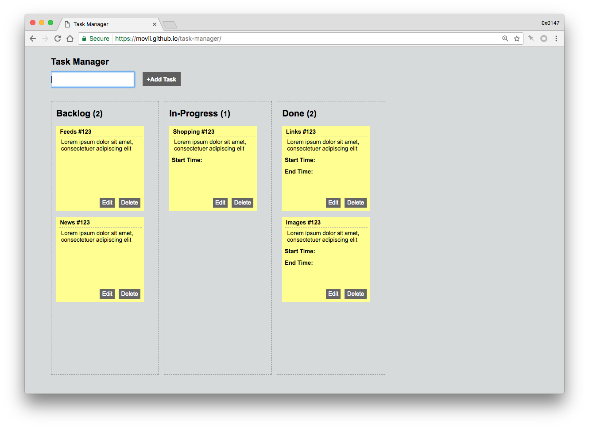

## 留作纪念的 task manager 
相关 blog 文章：[Demo：Task Manager](http://movii.github.io/blog/2013/02/26/a-task-manager/)

___

##### updated 2016-05-21
最近整理以前电脑的时候发现一个角落里的文件叫做 task manager，`index.html` 的创建日期是 2013-02-26，看了内容，想起来是以前丁总拿来的一个题目，说是现场实现一个题目要求的 Task Manager。具体的需求现在想不起来，但是得基于 `jQuery` 和 `jQuery UI`（如果是现场写得话，可能拖拽的实现没有一些包的支持也会挺麻烦）。

当时就开工作了，下午加上一个晚上？只能是貌似了。

现在看起来，完全只是 DOM 的操作，既没有 MVVM，也没有 Object-Oriented。拿出来放到 GitHub 上开个 `gh-pages` 做个留念，GitHub 的项目链接：[movii/task-manager](https://movii.github.io/task-manager/)；预览链接：[task-manager](https://movii.github.io/task-manager/)，但是并没有任何数据存储，完全只是前台的展示，执行操作后，刷新之后就还原了。
